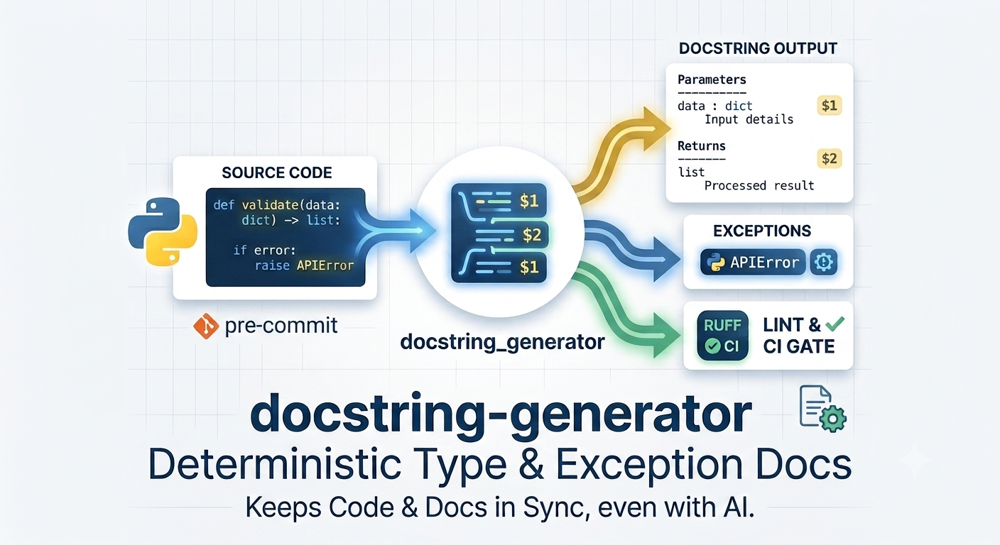

# AI Tools Write Your Code, but Who Keeps Your Docstrings from Lying?

### AI assistants are great at writing a first draft. A deterministic C++ engine can keep that draft aligned with the code.

---



If you write Python today, you are probably using an AI assistant. Tools such as Cursor, Copilot, and Claude Code can inspect a function and produce a polished docstring in seconds.

Case closed, right? We no longer need specialized documentation tooling.

Except there is a quiet problem that defeats passive AI-assisted documentation: **context drift**.

An assistant can generate a good description when asked, but it does not automatically revisit that description when somebody changes the function three weeks later. A parameter becomes optional, a return type changes, or a new exception is raised—and the old docstring stays where it is.

At that point, the documentation is no longer merely incomplete. It is actively misleading.

That is the gap I built [`docstring_generator`](https://github.com/FelixTheC/docstring_generator) to close. It reads Python signatures and type hints, generates structured docstrings, and updates the mechanical parts when the code changes. The goal is not to replace the useful prose written by a developer or an AI. It is to keep that prose attached to a structure that reflects the code.

---

## What the Library Does

At its simplest, `docstring_generator` can process one Python file or an entire directory:

```shell
pip install docstring-generator

gendocs_new service.py
gendocs_new src/
```

It generates docstrings for standalone functions and class methods, handles both `def` and `async def`, and derives parameter and return information from annotations and default values. `self` and `cls` are omitted from parameter sections, so generated output follows normal documentation conventions.

Three common formats are supported:

- NumPy, the default
- Google
- reStructuredText, for tools such as Sphinx

For example:

```python
async def fetch_user(user_id: int, include_profile: bool = False) -> dict:
    ...
```

can become a consistently structured NumPy, Google, or reStructuredText docstring without somebody manually copying the signature into prose.

The tool also protects mixed-style codebases. If an existing docstring uses a different convention, it detects that style and refuses to silently rewrite it. An intentional migration is still possible:

```shell
gendocs_new src/ --style google --overwrite-style true
```

That makes style conversion an explicit decision rather than a surprising side effect.

---

## Why Not Ask an LLM to Do All of This?

LLMs and deterministic tools solve different parts of the documentation problem.

### The token and latency tax

Sending a large repository to a model on every commit just to verify that signatures and docstrings agree is slow and unnecessarily expensive. Parsing code locally is a much better fit for repetitive structural work.

### Probabilistic output

An LLM may infer that a function can fail. A static analyzer can inspect its `raise` statements. For API contracts, that distinction matters.

### Loss of domain context

Regenerating a complete docstring can erase the explanation that only a person familiar with the business domain could write. Structural synchronization should not require throwing away useful prose.

### Governance and code privacy

Sending source code to an external model may be restricted—or prohibited entirely—for repositories that contain proprietary logic, security-sensitive code, or regulated data. Even when an AI provider offers suitable privacy controls, teams still need to decide which code may leave their environment, how prompts and outputs are retained, and who is accountable for reviewing generated documentation.

`docstring_generator` performs its analysis locally and does not need to send source code to a model. Its output follows explicit rules that can be versioned in `pyproject.toml`, reviewed in a diff, and enforced consistently in CI. That makes the documentation process easier to audit and gives security and compliance teams a clear answer to what ran, where it ran, and which policy it applied.

The productive division of labor is straightforward: let AI or a developer explain *why* a parameter exists, and let deterministic tooling maintain names, types, return sections, formatting, and detectable exceptions.

---

## Preserve the Explanations That Matter

Before generation, `$1`, `$2`, and subsequent markers associate descriptions with positional parameters. A `>>` marker does the same for the return value:

```python
def calculate_total(items: list[float], tax_rate: float) -> float:
    """Calculate the final invoice amount.

    $1 Prices before tax.
    $2 Tax expressed as a decimal, for example 0.19.
    >> The invoice total including tax.
    """
    return sum(items) * (1 + tax_rate)
```

With Google style selected, the result is structured without losing those descriptions:

```python
def calculate_total(items: list[float], tax_rate: float) -> float:
    """Calculate the final invoice amount.

    Args:
        items (list[float]): Prices before tax.
        tax_rate (float): Tax expressed as a decimal, for example 0.19.
    Returns:
        float: The invoice total including tax.
    """
    return sum(items) * (1 + tax_rate)
```

This is where AI fits well: use it to draft meaningful descriptions, then use the generator to place them into a predictable format and keep the surrounding structure consistent.

---

## Make Failure Modes Part of the Contract

The extension analyzes function bodies for explicit `raise` statements and adds them to a `Raises` section. That is particularly useful in validators and API code:

```python
@field_validator("api_config", mode="before")
@classmethod
def validate_api_config(cls, values: dict) -> dict:
    required_keys = values.get("required_keys")
    if not required_keys:
        raise ValueError("required_keys must be provided")
    if not isinstance(required_keys, dict):
        raise TypeError("required_keys must be a dictionary")
    return values
```

The generated documentation records both `ValueError` and `TypeError` instead of relying on somebody to notice and transcribe them. It is static analysis rather than a guess, and multiple raises in the same function are supported.

As with any static analysis, this describes what is visible in the function body; it is not a promise to discover every exception that could emerge from arbitrary code called further down the stack.

---

## Safe Enough for an Existing Codebase

Running a generator across a mature repository should be reviewable. Dry-run mode shows a unified diff without changing files:

```shell
gendocs_new src/ --dry-run
```

For a large Git repository, changed-only mode limits work to modified and staged Python files:

```shell
gendocs_new src/ --changed-only --dry-run
```

Projects can also exclude generated or internal code and skip magic methods:

```shell
gendocs_new src/ \
  --exclude-dir migrations \
  --exclude-dir tests \
  --exclude-file settings.py \
  --ignore-magic
```

Defaults belong in `pyproject.toml`, not in a command copied between developers:

```toml
[tool.docstring_generator]
strict = true
threshold = 90
exclude_files = ["settings.py"]
exclude_dirs = ["tests", "migrations"]
ignore_magic = true
```

Command-line options override project configuration when a one-off run needs different behavior.

---

## Coverage Checks for CI

Generation fixes documentation locally; coverage auditing makes the standard enforceable for a team. Check mode scans without modifying source files:

```shell
gendocs_new src/ --check
```

Add `--strict` to treat incomplete or outdated docstrings as undocumented, and use a threshold to fail the command when coverage is too low:

```shell
gendocs_new src/ --check --strict --threshold 90
```

That command can run in a CI pipeline alongside tests and linting. A pull request that adds an undocumented function can then fail for a clear, reproducible reason rather than depending on reviewer memory.

For local enforcement, the repository also provides a pre-commit hook:

```yaml
repos:
  - repo: https://github.com/FelixTheC/docstring_generator
    rev: <release-tag>
    hooks:
      - id: gendocs
        args: [src/, --style, google]
```

If the hook updates a file, the commit stops so the developer can review and stage the generated changes. The next run passes once the working tree is up to date.

---

## Why a C++ Backbone?

Documentation maintenance is most useful when it is cheap enough to run repeatedly. A slow pre-commit hook eventually gets bypassed.

The generation engine lives in [`docstring_generator_ext`](https://github.com/FelixTheC/docstring_generator_ext), a C++20 extension exposed to Python through pybind11. Python's `ast` module provides the signature, annotation, and function-body information; the extension turns that information into formatted docstrings and injects them into the source file.

```text
Python files or directories
          |
          v
  gendocs_new CLI
          |
          v
docstring_generator_ext
   (C++20 + pybind11)
          |
          +---- NumPy
          +---- Google
          +---- reStructuredText
```

The extension can also be used directly from Python through `parse_file()` and exposes a read-only `check_docstring()` coverage API. Most users, however, can stay with the CLI and `pyproject.toml` configuration.

Pre-built wheels mean users do not need a local C++ toolchain for a normal installation. Building the extension from source requires Python 3.13 or newer and a C++20-capable compiler.

---

## AI Plus Deterministic Tooling

AI assistants are excellent at producing a first draft and explaining domain intent. They are not persistent guardians of a changing codebase.

`docstring_generator` handles the repeatable part: generating docstrings from type hints, supporting sync and async code, preserving descriptions, extracting explicit exceptions, enforcing a chosen style, previewing changes, and measuring coverage in CI.

Let AI help write the explanation. Let a fast, deterministic tool keep the documentation aligned with the code on every commit.

- **GitHub:** [github.com/FelixTheC/docstring_generator](https://github.com/FelixTheC/docstring_generator)
- **PyPI:** [pypi.org/project/docstring-generator](https://pypi.org/project/docstring-generator/)
- **C++ extension:** [github.com/FelixTheC/docstring_generator_ext](https://github.com/FelixTheC/docstring_generator_ext)

---

**Suggested Medium tags:** `Python` · `Clean Code` · `Software Development` · `Artificial Intelligence` · `Open Source`
