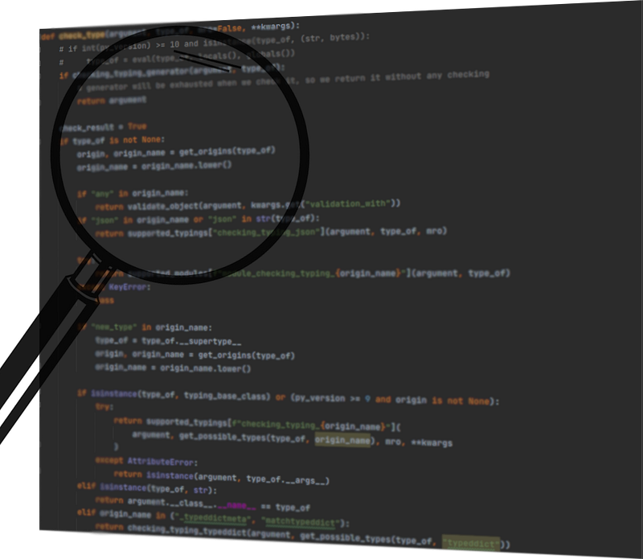

# Python Typechecking at the C-Level


For a while now, Python has featured type annotations, which help developers write cleaner code and avoid mistakes when using professional IDEs or `mypy`.

While static type checking is common, there are several runtime type checking libraries available (including one I created).

However, wouldn't it be better to have a general solution at the Python C-level? What would the effort involved look like? I went searching for answers and found a possible solution.

While the core developers would likely implement a more robust version, this approach works.

## Comparison: C-Level vs. Python Decorator

Let's look at two examples: one using C-level type checking and one using a custom decorator.

```python
from typing import List
import time

# 1. Standard function (targeted by C-level checking)
def tt_c(a: int, b: List[int]): 
    return a, b

# 2. Function with decorator
@match_typing 
def tt_decorator(a: int, b: List[int]):
    return a, b
```

Both achieve the same goal, but the performance difference is significant. We can use the following code for comparison:

```python
dummy = list(range(10000))
dummy.append("failure")
start_time = time.perf_counter()

try:
    tt(1, dummy)
except (TypeError, TypeMisMatch):
    pass

duration = time.perf_counter() - start_time
print(f"Needed {duration}ms")
```

### Performance Results

- **C-Level:** 0.0000759 ms
- **Decorator:** 0.0214870 ms

As expected, the C-level implementation is significantly faster, making a strong case for integrating type checking directly into the Python core.

## Implementation Details

To achieve this, I modified parts of the CPython source. This overview highlights the effort required.

I'd like to thank Anthony Shaw for his excellent book, *CPython Internals*, and the Python core developers who improve the language every day.

After some research, I identified `Python/ceval.c:call_function` (around line 5850) as the starting point, though I initially expected it to be elsewhere.

```c
Py_LOCAL_INLINE(PyObject *) _Py_HOT_FUNCTION
call_function(PyThreadState *tstate,
              PyTraceInfo *trace_info,
              PyObject ***pp_stack,
              Py_ssize_t oparg,
              PyObject *kwnames)
{
    PyObject **pfunc = (*pp_stack) - oparg - 1;
    PyObject *func = *pfunc;
    PyObject *x, *w;
    Py_ssize_t nkwargs = (kwnames == NULL) ? 0 : PyTuple_GET_SIZE(kwnames);
    Py_ssize_t nargs = oparg - nkwargs;
    PyObject **stack = (*pp_stack) - nargs - nkwargs;
    // ...
}
```

### Identifying Functions and Annotations

The first step is to verify if the called object is a function. Internally, Python doesn't distinguish between class methods and pure functions; both are of type `PyFunction_Type`.

```c
if (Py_IS_TYPE(func, &PyFunction_Type))
```

Next, we retrieve the annotations using a dedicated macro:

```c
PyObject *annotations = PyFunction_GET_ANNOTATIONS(func);
```

Interestingly, the underlying object must be handled as a tuple rather than a dictionary. The format is `('<ParameterName>', <class 'foo'>, '<ParameterName>', <class 'bar'>)`. For this proof of concept, I focused on positional arguments (`args`) and deferred keyword arguments (`kwargs`) for later.

To verify types, I used:

```c
PyObject_TypeCheck(arg, (PyTypeObject *)annotatedType);
```

and:

```c
PyObject_IsInstance(arg, originClass);
```

### Supporting Complex Types

Currently, I've implemented support for simple annotations like `int`, `str`, and `Foo`, as well as `UnionTypes`, `List[<type>]`, and `Tuple[<type>, Ellipsis]`.

Here is an example of how I handle `List[<type>]`:

```c
PyObject *originClass = PyObject_HasAttrString(annotatedType, "__origin__") 
 ? PyObject_GetAttrString(annotatedType, "__origin__") : NULL;

// Most typing classes (List, Tuple, Dict, Set, Union) have __args__
PyObject *subTypeArgs = PyObject_GetAttrString(annotatedType, "__args__");
Py_ssize_t subTypeArgsNum = PyTuple_GET_SIZE(subTypeArgs);

if (Py_Is(originClass, &PyList_Type))
{
    // Check if the object is a list
    result = PyObject_IsInstance(arg, originClass);
    if (!result)
    {
        break;
    }
    else
    {
        // Verify that all elements match the required type
        PyObject *requiredType = PyTuple_GetItem(subTypeArgs, 0);
        for (int k = 0; k < PyList_GET_SIZE(arg); ++k)
        {
            result = PyObject_IsInstance(PyList_GetItem(arg, k), requiredType);
            if (!result)
                break;
        }
    }
}
```

### Handling Exceptions

The most challenging part was managing exceptions at the C-level. My first attempt used:

```c
_PyErr_Format(tstate, PyExc_TypeError, "some message")
```

However, this was problematic due to missing cleanups. I eventually found that `do_raise` works better, though the resulting error messages are currently less descriptive:

```c
do_raise(tstate, PyExc_TypeError, Py_None);
```

## Conclusion

Integrating type checking into the C-level is feasible but requires significant effort. A key question remains: should we strictly enforce types and exit the program, or should we start with warnings? Warnings could be easily implemented using:

```c
PyErr_WarnEx(tstate, "Warning Message", 0);
```

We could also consider a Python CLI flag to enable or disable these restrictions. The future of this topic is certainly interesting.