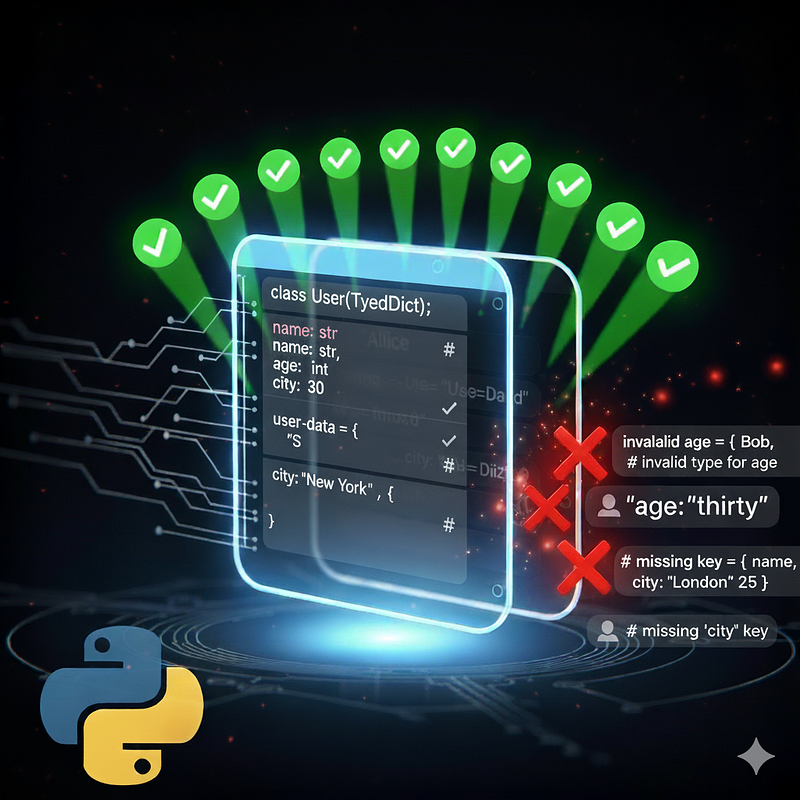

# Stronger Python TypedDict


In Python, `TypedDict` is a useful tool for bringing static type checks to dictionary-like structures, providing developers with greater control and clarity when dealing with dynamic data such as JSON, configurations, or API payloads.

However, despite its advantages, standard `TypedDict` falls short of enforcing stricter runtime validations or offering the flexibility required for complex workflows. This gap often leaves developers relying on external tools, manual checks, or even entire frameworks like **Pydantic**, which may feel excessive for projects that only need lightweight improvements to dictionary type safety.

## The Idea: A "Strong" TypedDict

So, what if you could make `TypedDict` just a little smarter—enforcing stricter validations, runtime type checking, and optional fields without sacrificing simplicity?

That's where the idea of a **"strong" TypedDict** comes in. By leveraging the power of decorators, validators, and your creativity, you can build a robust type-checking mechanism tailored to your needs. It's a lightweight yet powerful approach that enhances the developer experience while keeping your code safer and more predictable.

To achieve this, I used the [strongtyping](https://pypi.org/project/strongtyping/) package, which includes the `@match_class_typing` decorator and the `Validator` type.

## A Practical Example

The best way to understand the benefits is through an example. Let's start with a simple `TypedDict` for a possible API.

```python
from typing import TypedDict

class User(TypedDict):
    id: str
    username: str
    description: str | None
```

To validate it manually, we would need to create a function that must be updated every time we add or remove a field. Wouldn't it be better if we could include validation directly to achieve simple runtime type checking?

### Adding Runtime Validation

By using `strongtyping`, we can enhance our `User` class:

```python
import uuid
from typing import TypedDict
from strongtyping.strong_typing import match_class_typing
from strongtyping.types import Validator

def is_convertible_to_uuid(x: str) -> bool:
    try:
        uuid.UUID(x)
    except ValueError:
        return False
    return True

@match_class_typing
class User(TypedDict):
    id: Validator[str, is_convertible_to_uuid]
    username: Validator[str, lambda x: 10 <= len(x) <= 15]
    description: str | None
```

*Note: In the example above, I fixed the lambda for username validation to `10 <= len(x) <= 15` for clarity.*

Now, you can be sure that even without additional testing code, this `TypedDict` will throw an exception when initialized with invalid data.

```python
# This will throw a `ValidationError`
User({"id": "0123", 
      "username": "loremipsum", 
      "description": None})

# And this will pass
User({"id": "63f24361-57cc-42b2-9310-06af5bd3eff4", 
      "username": "loremipsumdolor", 
      "description": None})
```

## Lightweight Helpers

If you want to avoid `try-except` blocks, you can use a helper function from the `strongtyping` package.

```python
from strongtyping.helpers import validate_typed_dict

example_request_data = {
    "id": "63f24361-57cc-42b2-9310-06af5bd3eff4",
    "username": "loremipsumdolor",
    "description": None,
}

if validate_typed_dict(User, example_request_data):
    # do something with the data
    pass
else:
    # handle the error
    pass
```

## Handling Unexpected Data

Standard `TypedDict` allows additional keys unless `total=False` is used, but it doesn't strictly prevent them at runtime in a way that flags unexpected API inputs. Fortunately, `strongtyping` addresses this.

```python
@match_class_typing(throw_on_undefined=True)
class User(TypedDict):
    id: Validator[str, is_convertible_to_uuid]
    username: Validator[str, lambda x: 10 <= len(x) <= 15]
    description: str | None
```

By enabling `throw_on_undefined`, we ensure that any attempt to misuse our API by including unexpected or undefined fields in a request is promptly flagged.

## Resources

- **PyPI:** [strongtyping](https://pypi.org/project/strongtyping/)
- **Documentation:** [strongtyping docs](https://strongtyping.readthedocs.io/en/latest/match_class_typing/)